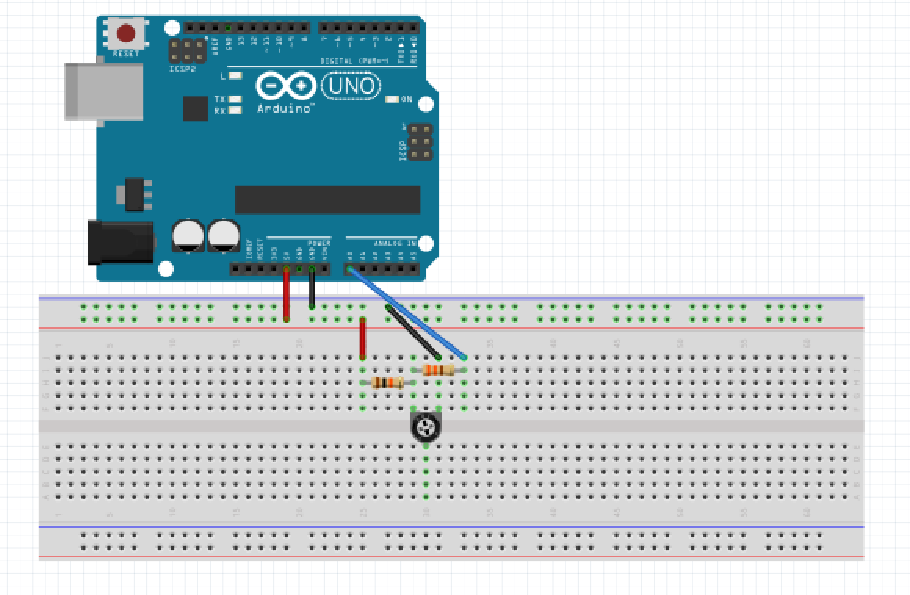
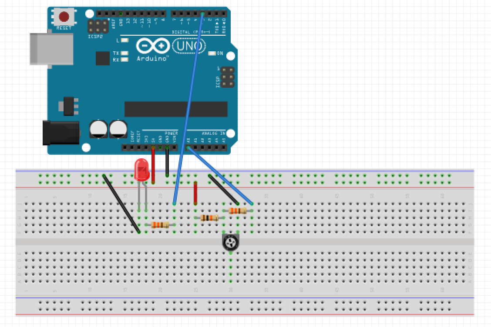

# Lab 1

In Lab 1, we had to construct several simple circuits using multiple external components and the Arduino Uno microcontroller. With the Arduino microcontroller and the Arduino IDE, we constructed several simple Arduino programs, which culminated with us building our first robot and having it drive autonomously in a figure eight pattern.

## Task 1 - Blinking the Internal LED:
The first task was to use the arduino to blink an internal LED. The on-chip LED is hard-wired to pin 13 which we set up as an ouput using the following code:

```cpp
#define PIN_NUMBER LED_BUILTIN

void setup() {
  pinMode(PIN_NUMBER, OUTPUT);
}
```

We then turned the LED on and off by setting it to high and low respectively:

```cpp
void loop() {
  digitalWrite(PIN_NUMBER, HIGH);   
  delay(1000);                       // waits for a second
  digitalWrite(PIN_NUMBER, LOW);    
  delay(1000);                       
}
```

Demo:
<iframe width="560" height="315" src="https://www.youtube.com/embed/FUZXOQbeATo" frameborder="0" allow="autoplay; encrypted-media" allowfullscreen></iframe>

## Task 2 - Blinking an External LED:
Our next task was to modify the code for task one to blink an external LED. We did this by connecting an external LED to a digital pin through a resistor as shown in the diagram below:


All we did in the code for this task was to change our Pin Number from the on-chip LED to the pin that we connected to the external LED: 

```cpp
#define PIN_NUMBER 0
```

The resistor was used to prevent sourcing too much current through the pin in case of a short circuit, which would burn out both the Arduino and the external LED.

Demo:
<iframe width="560" height="315" src="https://www.youtube.com/embed/RYbxh-uWJU4" frameborder="0" allow="autoplay; encrypted-media" allowfullscreen></iframe>

## Task 3 - Reading an Analog Input:

Our third task was to detect changes in the resistance value of a potentiometer through an analog input pin and print the value to the serial monitor. This was accomplished by setting up a voltage divider circuit as shown below and connection the output of the circuit to an analog pin:



We then used the following code to set A0 as our analog pin and setup the serial monitor:

```cpp
int potIPT = A0;

void setup() {
  Serial.begin(9600);   
}
```

Using the analogRead function, we were able to read the voltage value from the analog pin and output that value to the serial monitor every half second:

```cpp
void loop() {
  int val = analogRead(potIPT);  // read the input
  Serial.println(val);           // print to serial monitor
  delay(500);                    // wait half a second
}
```

## Task 4 - Outputting an Analog Signal:

Combining the setups of Tasks 2 & 3, we designed the following circuit which allowed us to use the analog signal input from the potentiometer to control the brightness of the external LED:



The LED could only be connected to one of the 6 digital pins which could output a PWN signal, which was required to simulate the effect of an analog voltage. The digital pin was set up as an output exactly as in Tasks 1 & 2. Inside the loop, we used the analogWrite function to output the analog voltage to the digital pin:

```cpp
void loop() {
  int val = analogRead(potIPT);     // read the input pin
  analogWrite(PIN_NUMBER, map(val, 0, 1023, 0, 255));
}
```

The 10-bit ADC (Analog-to-Digital Converter) is able to input analog values from 0 to 1023, however the LED is only able to input voltage values from 0 to 255, so we used the map function to make sure that we didnt exceed the voltage limits of the LED.

Demo:
<iframe width="560" height="315" src="https://www.youtube.com/embed/4hCbVb7QNAI" frameborder="0" allow="autoplay; encrypted-media" allowfullscreen></iframe>

## Task 5 - Controlling Parallax Servos:

Our final task before assembling our robot was to use the PWM signal we generated in the previous task to drive and control a Parallax Continuous Rotation Servo. We did this using the Arduino Servo.h library. First we set up the servo and the serial monitor.

```cpp
#include <Servo.h>
#define PIN_NUMBER 3

Servo myservo;  // create servo object to control a servo
int potIPT = A0;

void setup() {
  myservo.attach(PIN_NUMBER);
  Serial.begin(9600);
}
```

We then output the analog voltage of the potentiometer setup through the digital pin, as in Task 4, to control the speed and direction of the servo, with the only difference being that the range of voltage values for the servo was from 0 to 180 instead of 0 to 255.

Demo:
<iframe width="560" height="315" src="https://www.youtube.com/embed/89UeEeVpefA" frameborder="0" allow="autoplay; encrypted-media" allowfullscreen></iframe>

## Task 6: Assembling the Robot

The parts we used to assemble our robot were:
- 2 servos
- 2 servo mounts
- 2 wheels
- 1 baseplate
- 11 screws
- 11 nuts
- 1 ball bearing wheel
- 1 arduino
- 1 rechargeable battery pack

The first thing we did was mount the servos to the servo mounts. As there was a shortage of screws and nuts in the lab, we only used two screws per servo instead of the four there are room for. The robot built in this lab will not be the same as the final robot, so we just needed enough screws to maintain structural integrity.

The servos were then mounted to the baseplate, using two screws per mount.

The wheels were then mounted to the servos. As one of our servos did not have a screw, we used wheels that fit snug on the servos. This is an issue that we will need to fix when designing later robots.

Next, we mounted the Arduino on top of the baseplate using two screws.

Finally, we attached the ball bearing wheel to the front of the robot.

## Task 7 - Driving the Robot Autonomously:

Once the robot was built, we wrote code for the robot to autonomously drive in a figure eight pattern.

The 2 servos and digital output pins were set up as in the previous tasks and connected using the attach function:

```cpp
void setup() {
  leftWheel.attach(LEFT_WHEEL_PIN);
  rightWheel.attach(RIGHT_WHEEL_PIN);
}
```

To control the movements of the robot, we had 3 basic functions: moveForward, moveRight, and moveLeft. The moveForward function worked by turning both wheels in the same direction at the same speed. The moveRight function worked by turning the left wheel forward while at the same time turning the right wheel backwards in order to pivot the robot and make it turn right. The moveLeft function worked in the same way but with the directions reversed.

```cpp
void moveForward() {
  leftWheel.write(FORWARD_POS);
  rightWheel.write(FORWARD_POS);
  delay(straightTime);
}

void moveRight() {
  leftWheel.write(FORWARD_POS);
  rightWheel.write(BACKWARD_POS);
  delay(rightTime);
}

void moveLeft() {
  leftWheel.write(BACKWARD_POS);
  rightWheel.write(FORWARD_POS);
  delay(leftTime);
}
```

Using these three funcitons in the following order would make the robot drive autnomously in a figure eight pattern:

```cpp
void loop() {
  moveStop();     //stops both wheels
  moveForward();
  moveLeft();
  moveForward();
  moveRight();
  moveForward();
  moveRight();
  moveForward();
  moveRight();
  moveForward();
  moveRight();
  moveForward();
  moveLeft();
  moveForward();
  moveLeft();
  moveForward();
  moveLeft();
}
```

The first time we tested the robot, it became apparent that one of our servos was spinning much faster than the other; so much faster that the robot was practically impossible to control.

We performed a series of tasks in order to identify the problem. First, we swapped the pins for our two servos. This would check to see if the issue was in the software rather than in the hardware. After switching the pins had no effect, we decided to try a third servo. The third servo was much closer to the speed we were expecting, so we switched out the super fast servo. After this switch, we were able to get out robot to drive in straight lines and in a proper figure eight pattern.

Demo:
<iframe width="560" height="315" src="https://www.youtube.com/embed/GhzqjIfTxn0" frameborder="0" allow="autoplay; encrypted-media" allowfullscreen></iframe>

## Bloopers :sweat_smile:

<iframe width="560" height="315" src="https://www.youtube.com/embed/d9uHi5ukqcA" frameborder="0" allow="autoplay; encrypted-media" allowfullscreen></iframe>

