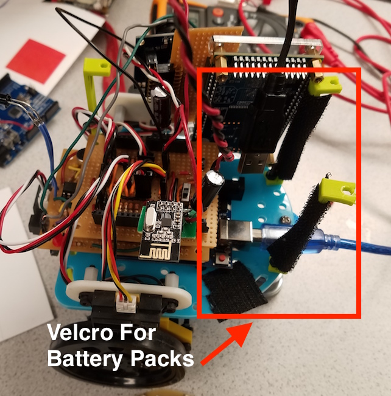
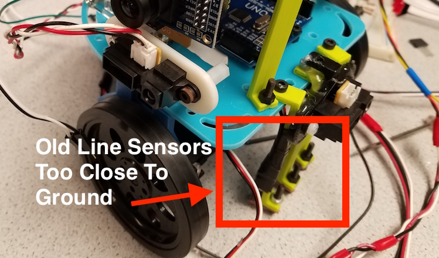

# Final Robot Design

## Mechanical

The final mechanical design of our robot was similar to that of previous iterations. The biggest difference was that we got rid of the second base that was on top because we transitioned from breadboards to stacking perfboards. We also had to move the location of the battery because since we added an additional line sensor between the existing ones, it became difficult to access the battery underneath. To fix this, we added velcro to the base of the robot and the stands that used to hold the second base so that the battery could be attached there and be easily accessed.



Another major change that we made was that we increased the height of the line sensors and added a third line sensor in between the original two. We initially increased the height because we realized that the line sensors were too close to the ground and would sometimes get caught on the mat. However, we later realized that increasing the height of the line sensors gave better readings to the arduino and allowed us to do line sensing much better. The third line sensor was also added to help us increase the accuracy of our line detection.



The rest of the robot consists of the servos, the wall sensors on its perimeter and our functioning IR Hat. There are three wall sensors, two on the sides and one on the front of the robot, that were attached to the base plate using mounts. Our IR Hat was placed with the constraint that it has to be around 5.5 inches off the ground. To meet this requirement, we bolted it on top of a stand that used to support the second base plate.


## Hardware

Our robot uses a second ATmega chip (other than the one on the Arduino) to perform all of our FFT calculations and camera setup. We chose to do this so that our Arduino did not have to waste time doing the FFT calculations for sound and IR detection and could instead worry about maze exploration and primary sensor control. This design also allowed us to minimize the number of pins we used on our Arduino, especially as we no longer needed two analog pins for camera setup. This added the extra complexity of needing to remove the ATmega chip and reprogram it if we wanted to change any of the FFT code. Luckily, once we chose correct thresholds this no longer needed to be done.

We had put off cleaning up the wiring of our robot for a while, but decided it needed to be done before the final competition. We decided on a stacking board design for our wiring as it would allow us to easily assemble and disassemble our robot while still giving us access to all the arduino pins in case we needed to add additional hardware. Originally, we wanted to mill two PCBs: one for our microphone and IR components, and one for our servos and remaining sensors. We developed schematics and layouts for both boards using Eagle. 

Here is the layout for our microphone and IR circuit:


And here is the layout for our servos and sensors circuit:


Several important considerations were made when designing these boards. First, with our microphone and IR board, we needed our IR sensor to be positioned at the front of the board (lining up with the front of the robot) and our microphone needed to be exposed so as to get the best sound reception. Second—with our servos and sensors board—we needed the positions of the headers on the board to line up with where their respective sensor or servo would be located on the robot. We decided that this board needed to be on top as to give us easy access to all the header pins; a board on top of this would get in the way. Also, this board needed to be shorter than the bottom board so that the microphone could remain uncovered. 

With the top board we decided to add several additional features, including an override button, on-off switch, and power header. The override button was there in case our robot was not able to successfully start from the tone. Since the start signal was being sent from our second ATmega chip to a digital pin on the Arduino, we did not need any additional pins to implement this button. Instead, the button just pulled the signal to the existing digital pin high when pressed. The on-off switch was added to allow us to control power to the robot without having to unplug it. The power header was added to allow us to power the robot directly from the battery pack instead of from the arduino. All the components on the top board were connected to this power header and to the VIN pin of the arduino. The components on the bottom board were left powered by the arduino as there were only a few of them and none of them drew a lot of current. 

Unfortunately, we had technical difficulties getting our first board to mill properly. A PCB also would not have given us any flexibility if we decided to move any components around or add additional components (flexibility we would end up needing). Instead of PCBs, we decided to use perf boards. We wanted to keep the stacking design of the boards, so one side of the bottom board needed to be bent slightly as to line up correctly with the Arduino headers. As to not waste the layouts produced for the PCBs, we decided to lay out our perfboards in almost the same manner. 

Here is an image of our final perf boards circuit:


We also added an additional line sensor to our robot in an effort to make our line following more robust. Instead of using defined thresholds for white and black, our system would calibrate depending on the reading of the middle line sensor; this sensor was to always be on the line while the outside two off the line. This allowed our robot to function properly in many different lighting conditions, as the lighting on the day of the competition could not be predicted.

The final major hardware modification we made to our robot dealt with the position of our IR sensor. When testing our robot collision avoidance we ran into two major problems: our IR sensor would occasionally detect our own IR hat and also could not detect other robots until they were too close. To mediate both these problems, we decided to mount our IR sensor pointing down roughly 1.5 to 2 inches above our IR hat. We found through testing that most of the IR light emitted from the hats went upwards, no matter the placement of the hat. We believe this is because since the LEDs are surface mounted to the top of the hat, the light they emit is mostly blocked from going downward by the physical hat itself. If the hat was mounted upside down—as some teams did—then the light would go downwards, reflect off the ground, and then go back upwards. This positioning of our IR sensor gave us a consistent 5-7 inches of clearance before detecting another robot. This range could also be changed depending on the angle we bent the IR sensor at. This also coincidentally solved the problem of our robot detecting its own IR hat. It used to detect its own hat near walls, as the IR light would reflect off the walls and back into our own sensor. When we repositioned our sensor to above the IR hat it was now higher than the walls of the maze, so light could not be reflected back into the sensor. We also tested to make sure we could not detect a robot on the opposite side of a wall from us. Our robot detection was working correctly.

[//]: # (*ADD IR TEST VIDEO HERE*)

Here is an image of our final robot before the competition:


## Software

We had several pieces of code split over a few microcontrollers: FPGA code that did treasure detection, base station code that received messages and updated the GUI, robot code that ran the maze exploration and primary sensor code, and the atmega code which ran the FFT code and set up the camera.

### FPGA

Although the basic ideas behind our color and shape detection didn’t change much from what we had in our FPGA code in milestone 4, we spent a lot of time post milestone 4 adjusting the threshold values for the color and shape detection to get the most consistent results possible.

Before that however, we would like to mention some major changes we had made to the provided FPGA code for milestone 4, but had neglected to touch upon in our writeup for the same. One of these changes was to increase the width of the pixel data stored in the FPGA memory from 8-bits per pixel all the way to 32-bits per pixel. This allowed us to store both the 16-bit RGB565 color data as well as the 16-bit greyscale data for each pixel, which in turn allowed us to increase the accuracy of both our color and shape detections. At first we were afraid that the FPGA board would not have enough memory to store this much data, but after testing we discovered that we were able to store the 32-bit pixel data just fine. We did realize, however, that the VGA driver we were using was only able to output the pixel data to the monitor in the RGB332 format, so we moved the downsampling code we had written in lab 4 to the VGA_DRIVER file and downsampled both the color and greyscale pixel data, before choosing one of them to be output to the monitor.

```verilog
assign PIXEL_COLOR_EDGE  = {PIXEL_COLOR_IN[15:13], PIXEL_COLOR_IN[10:8], PIXEL_COLOR_IN[4:3]};
assign PIXEL_COLOR_DSAMP = {PIXEL_COLOR_IN[31:29], PIXEL_COLOR_IN[26:24], PIXEL_COLOR_IN[20:19]};

assign PIXEL_COLOR_OUT = (pixel_count<(`VISIBLE_SCREEN_WIDTH) ? (PIXEL_COLOR_DSAMP) : (8'b00000000) ;
```

Another major change we had made in milestone 4 was to move all the functionality of the IMAGE_PROCESSOR module into the main DE0_NANO file. This was because we found that, although the color and shape detection was working fine in the IMAGE_PROCESSOR module, we were having a lot of difficulty transferring over the correct result into the DE0_NANO file to be sent back to the Arduino. Another problem we were facing while using the IMAGE_PROCESSOR file was that sometimes the program would not compile properly due to insufficient memory on the FPGA, but only sometimes. Moving all of the image processing code from the IMAGE_PROCESSOR file to the main DE0_NANO file fixed both of these issues.

```verilog
// get camera input
input_1 = CAMERA_INPUT;
...
input_2 = CAMERA_INPUT;
pixel_data_RGB565 = {input_2, input_1};

redRDif = 5'b11111 - pixel_data_RGB565[15:11];
redGDif = 5'b01000 - pixel_data_RGB565[10:6];
redBDif = 5'b01000 - pixel_data_RGB565[4:0];

blueRDif = 5'b00001 - pixel_data_RGB565[15:11];
blueGDif = 5'b00001 - pixel_data_RGB565[10:6];
blueBDif = 5'b00101 - pixel_data_RGB565[4:0];

grey = input_2[7:3] + {input_2[2:0], input_1[7:6]} + input_1[4:0];

// edge detection
if (Y_ADDR % 12 == 0 && X_ADDR >= 30 && X_ADDR < 150) begin
  if (grey_eg[7:3] > curBrightestVal) begin
    curBrightestVal = grey_eg[7:3];
    pixel_data_RGB565 = 16'b1111111111111111;
    curXB = X_ADDR;
  end
end

// color detection
if (Y_ADDR % 12 == 1 && X_ADDR == prevXB - 20) begin
  if (redRDif <  `C_THRESH && redRDif >  -`C_THRESH &&
      redGDif <  `C_THRESH && redGDif >  -`C_THRESH &&
      redBDif <  `C_THRESH && redBDif >  -`C_THRESH    )
    numRed = numRed + 1;
  else if (blueRDif <  `B_THRESH && blueRDif >  -`B_THRESH &&
      blueGDif <  `B_THRESH && blueGDif >  -`B_THRESH &&
      blueBDif <  `B_THRESH && blueBDif >  -`B_THRESH    )
    numBlue = numBlue + 1;
end

// detecting as red triangle
if (VSYNC == 1'b1 && v_flag == 0) begin
  RES_1 = 0;
  RES_0 = 0;
  if (numRed >= 6) begin
    RES_2 = 1;
    if ( numNeg >= 6 ) begin
      RES_1 = 1;
      RES_0 = 0;
    end
    ...
  end
  ...
end
```

After the changes mentioned above, and once we were happy with all of our threshold values, we attached the camera to the robot and tested out whether we would be able to successfully detect the treasures in an actual maze. Unfortunately, our testing showed that although our camera was definitely able to detect the treasures in most of the cases, it was also giving us a lot of false positives, and the extremely strict point criteria for detecting false treasures or mistaking one or more of the aspects of the treasures made it so that doing treasure detection in the competition was not worth the risk, so we scrapped the camera and FPGA from our final robot.

### Atmega

The first section of the Atmega code was for setting up the camera. The code for the camera was adjusted from milestone 4 by writing to more registers to improve the image from the camera and by changing the pins used to communicate with the FPGA. Now, the arduino uses three analog pins to read values from the FPGA rather than the digital pins. For the registers, we first enabled the fast AEC/AGC algorithm by writing 0x88 to address 0x13 (COM8) and to disable to auto white balance. This is so we can set the gain for blue, red and green by writing 0x80, 0x40 and 0x4E to addresses 0x01, 0x02 and 0x6A respectively. These values were chosen arbitrarily but they will matter based on the environment you are in. The exposure time for automatic exposure control was set by writing 0x40 to 0x07, which was also arbitrarily chosen and will also depend on the environment, giving a window for the camera to adjust properly. However, 0x40 only represents the first 6 bits of AEC. The middle 8 bits are determined by register 0x10 and it also helps determine the exposure time. In our case, 0x24 was written to 0x10.

The gain setting was adjusted by writing to addresses 0x00 and 0x03. This was done because we disabled the AGC when writing to COM8. GAIN (0x00) represents the least significant bits of the gain and VREF (0x03) represents the most significant bits of the gain. These registers were set to 0x0F and 0x00. Along with the gain, we could adjust the noise so that we could reduce the SNR and enhance our image quality. Register 0x4C sets the denoise threshold, which we set to 0xFF.

Finally, the brightness and contrast of the camera could be adjusted with registers 0x55 and 0x56 respectively. The values for them were 0x60 and 0x80, but these depend on your surroundings. For all of the registers mentioned above, they were set to values near their default ones. We first read the values of all of the registers and then tweaked with the register values until we got an image that worked well. We used [this](https://github.com/dalmirdasilva/ArduinoCamera/blob/master/CameraAL422B/datasheet/OV7670%20Implementation%20Guide%20(V1.0).pdf) document to get a better idea for what each register did.

```cpp
// reset registers
OV7670_write_register(COM7, 0x80);

set_color_matrix();

// QCIF (176x156) RGB output format
OV7670_write_register(COM7, 0x0C);

// enable scaling for QCIF
OV7670_write_register(COM3, 0x08);

// Use external clock
OV7670_write_register(CLKRC, 0xC0);

// set to RGB 565 mode
OV7670_write_register(COM15, 0xD0);

// adjust the gain ceiling
OV7670_write_register(COM9, 0x6A);

// mirror the image
OV7670_write_register(MVFP, 0x30);

// freeze the automatic settings
OV7670_write_register(COM8, 0x88);

// set white balance blue
OV7670_write_register(WB_B, 0x80);

// set white balance red
OV7670_write_register(WB_R, 0x40);

// set white balance green
OV7670_write_register(WB_G, 0x4E);

// set exposure upper bits
OV7670_write_register(AEC, 0x40);

// set exposure lower bits
OV7670_write_register(AEC_M, 0x24);

// set gain lower bits
OV7670_write_register(G_LSB, 0x0F);

// set gain upper bits
OV7670_write_register(G_MSB, 0x00);

// set denoise threshold
OV7670_write_register(0x4C, 0xFF);

// set brightness
OV7670_write_register(0x55, 0x60);

// set contrast
OV7670_write_register(0x56, 0x80);
```

The second part of the atmega code was the FFT code. This code remained mostly unchanged from milestone 3, although we did adjust the threshold values slightly. We realized that our IR hat was too sensitive and was detecting our own IR hat or reflections of our IR hat off the wall. We were also able to mitigate this problem by changing the positioning of the IR LED, as described above.

### Arduino

The final code that we ran on was split into 4 main parts to keep everything the codebase cleaner. 
The first part was the sensor code. The sensor code contained the code that we used to read the line sensors and distance sensors. We then applied some averaging and other algorithms to the data to make the data more useable. For the distance sensors, we made a function that took a few readings of each sensor and then averaged them. This helped smooth out any noise from the sensors:

```cpp
void update_wall_sensor(unsigned long* reading, int sensor_num) {
  *reading = 0;
  for(int i = 0; i < NUM_WALL_READINGS; i++) {
    *reading += analogRead(sensor_num);
  }
  *reading = *reading / NUM_WALL_READINGS;
}
```

The line sensing code was more complicated. We would first calculate the value that each of the digital line sensors was reading. Then, if the reading was valid we would update a ring buffer of previous values. This was to enable efficient averaging of the data. We then did something interesting: we used the center line sensor reading to calibrate the other 2 line sensors. Because the center line sensor is almost always over the center line and because all of the line sensors are approximately the same, we would be able to calibrate our thresholds for what counted as a line based on the center line sensor. We needed to be careful though: there are times when the middle line sensor is not on a white line. These are mostly when it is turning left or right. So we added support for disabling updates to the center line reading in those circumstances. We also set a threshold for the maximum value that the center line should read, so that even if it did go off the center line when not turning left or right, it wouldn’t mess up the thresholds.

```cpp
leftSenseBuf[leftSenseHead] = leftTime;
leftSenseHead = (leftSenseHead + 1) % SENSOR_AVE_SIZE;

if (updateCenterReading && centerTime < MAX_CENTER) {
 centerSenseBuf[centerSenseHead] = centerTime;
 centerSenseHead = (centerSenseHead + 1) % SENSOR_AVE_SIZE; 
}
   
int sum = 0;
for(int i = 0; i < SENSOR_AVE_SIZE; i++) {
  sum += leftSenseBuf[i];
}
SENSOR_LEFT_READING = sum / SENSOR_AVE_SIZE;

sum = 0;
for(int i = 0; i < SENSOR_AVE_SIZE; i++) {
  sum += centerSenseBuf[i];  
}
SENSOR_CENTER_READING = sum / SENSOR_AVE_SIZE;

// Update the threshold value
LEFT_SENSOR_THRESH = SENSOR_CENTER_READING+LEFT_DIFF;
```

The next piece of code was our state machine. We added a few states and variables for error detection and recovery to this code from milestone 3. We realized that we could time how long it takes to traverse 2 intersections and set a ceiling on the time it should take to traverse one intersection to approximately two-thirds of that value. Then, we can use the Arduino’s internal timer to periodically check how long its been since we have been at an intersection. If that time goes above some threshold, then our line detection must have messed up, and we stop and update our state, just like we would if we had detected an intersection. 

```cpp
if (state == FORWARD) {
 if (millis() - state_start_time > FORWARD_TIME_THRESH) {
    // Must have missed intersection. Get next action
   state = GET_NEXT_ACTION;
 } else {
   // perform normal line following code
   ...
 }
 ...
}
```

During tests, we observed that the robot sometimes detected intersections where there were none. In order to make our robot more robust to small changes in tape color, we added a new state that the robot goes into when it thinks it detects and intersection. First it waits for a few cycles until it gets totally fresh sensors readings. Then, it reevaluates if it is still at an intersection and if it is, then it stops and figures out what to do next. This robustness code was difficult to test as the line sensor errors where difficult to reproduce. However, the code did seem to work in a toy environment with only a straight line.

```cpp
if (state == SAW_INTER) {
  // wait for sensors to settle
  if (forwardWait < 4) {
    forwardWait++;
  } else {
    if (SENSOR_LEFT_READING < LEFT_SENSOR_THRESH && SENSOR_RIGHT_READING < RIGHT_SENSOR_THRESH) {
      // go forward and center over line
      leftWheel.write(FORWARD_LEFT);
      rightWheel.write(FORWARD_RIGHT);
      delay(150);

      state = GET_NEXT_ACTION;
    } else {
      // false intersection
      state = FORWARD;
    }
  }
} 
```

Finally, we needed to add code to handle making U-turns due to detection of another robot by the IR sensor. When we detect an IR hat while going forward we transition into the turn left state. Once we finish the left turn there are 2 possibilities: either we turned 90 degrees or 180 degrees. In order to tell the difference we again measured the average time to turn 135 degrees and coded that number in as a threshold. Then, once we have finished attempting the U-turn, we check how long the turn took and make adjustments to the maze exploration algorithm to fix our position.

```cpp
if(digitalRead(FFT_DATA_PIN) == HIGH) {
  state = LEFT_1;
  attempt_u_turn = 1;
}
...
if (attempt_u_turn) {
  // reset next value
  maze[robotY][robotX] = 0;

  // move my position back
  robotDir = (robotDir + 2) % 4;
  adv(&robotX, &robotY, robotDir);

  if (millis() - state_start_time > 1100) {
    // made u turn
    state = FORWARD;
    attempt_u_turn = 0;
  } else {
    // only turned 90 degrees to the left, finish 180 degree turn
    state = LEFT_1;
    attempt_u_turn = 0;
  }
}
```

The maze exploration algorithm was mostly unchanged from milestone 3. The primary innovation that we made in our maze exploration code was the low number of bytes it required. The data structures that contained the maze information and the maze traversal algorithm took up 3 bytes per cell, giving 243 bytes for the whole algorithm. The image below shows the compile size of the maze code with some print statements through the serial monitor. The serial code takes up 192 bytes on its own, so the maze code takes up 498-192 = 306 bytes, which includes maze information and other miscellaneous information. 


This efficiency was made possible by our implicit pointers in the maze traversal data structure. You can also see this efficiency in our final robot global variable size. Of course it also helped that the FFT code was on the atmega. However, even if we didn’t have the extra chip, we would have still been able to support the FFT library on the single arduino.


The final part of the code base was the radio code. This was also mostly unchanged from milestone 3. We did add support for sending the treasure information but after deciding not to add the camera to the robot we disabled this part of the code.

# Final Competion

Our robot ran into two different problems—one during each round—that hindered our performance during the competition.

During the first round, our radios failed to synchronize, leading there to be no transmission of data from the robot to the base station. Unfortunately, this happened to be the round where our robot performed better in the maze. It appears as so our robot successfully navigated over half of the maze successfully during this run, which could have potentially put us in the running for the final round. Although we cannot verify how accurately our robot mapped out the maze without the GUI output, we do have a video of how our robot performed during round 1:

<iframe width="560" height="315" src="https://www.youtube.com/embed/oG1nnlTRdGE" frameborder="0" allow="accelerometer; autoplay; encrypted-media; gyroscope; picture-in-picture" allowfullscreen></iframe>

During the second round, our robot seemed to be performing very well at the beginning as it quickly began to explore the maze and reached the opposite quadrant within 30 or so seconds. But, in the opposite quadrant there seemed to be a particular location where our robot detected a false intersection and would get lost. This happened twice in the exact same location.

<iframe width="560" height="315" src="https://www.youtube.com/embed/V3bIOu-QYhs" frameborder="0" allow="accelerometer; autoplay; encrypted-media; gyroscope; picture-in-picture" allowfullscreen></iframe>

<iframe width="560" height="315" src="https://www.youtube.com/embed/f5m7mTJ46uQ" frameborder="0" allow="accelerometer; autoplay; encrypted-media; gyroscope; picture-in-picture" allowfullscreen></iframe>

Even though our robot did not perform exactly how we wanted it to on competition day, we believe that the system we developed over the course of the semester had many interesting and unique ideas and we are proud of the work that we did.

# Budget

| Item                | Cost | Quantity | Total Cost |
|---------------------|------|----------|------------|
| Line sensors        | 3    | 3        | 9          |
| IR distance sensors | 7    | 3        | 21         |
| Camera              | 14   | 1        | 14         |
| Servos              | 13   | 2        | 26         |
| Arduino Uno         | 16   | 1        | 16         |
| atmega328p          | 4.30 | 1        | 4.30       |
| lm358               | 0.60 | 1        | 0.60       |
| Perf board          | 2.00 | 2        | 4.00       |
| IR hat              | 2.00 | 1        | 2.00       |
| Total               |      |          | 96.90      |
